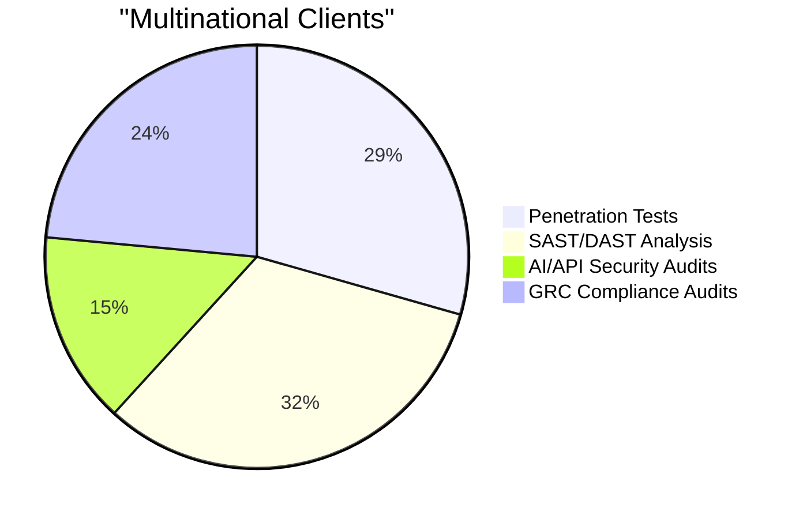

# Hi there, I'm Cyber-Hunter 👋 
### **Lead Application Security Engineer | Pentester | Tech Educator**

An experienced Cybersecurity Professional specializing in **Offensive Security**, **Cloud-Native Infrastructure**, and **Strategic GRC**. I bridge the gap between technical exploitation and executive risk management while mentoring the next generation of security researchers.

---

## 🛡️ Professional Pillars

### 🚀 **AppSec & DevSecOps**
* **Orchestration:** Advanced **SAST, DAST, IAST,** and **RASP** implementation.
* **Cloud-Native:** Engineering high-availability **Kubernetes** clusters with secure **CI/CD** pipelines.
* **Hardening:** Specialized in **Docker** runtime protection and auto-scaling node security.
* **Cloud Defense:** Multi-cloud security across **AWS, GCP, and Azure**.

### ⚔️ **Offensive Security & AI**
* **Penetration Testing:** Deep-dive exploitation of Web, Network, and Cloud infrastructures.
* **AI Security:** Implementing security gates for **Generative AI** and **LLM API** protection.
* **Red Teaming:** Advanced threat detection, packet analysis, and malware reverse engineering.

### 📋 **GRC & Audit**
* **Frameworks:** Aligning technical findings with **RMF** and **NIST** standards.
* **Compliance:** Managing **POA&M** remediation and technical audits for **EMEA/APAC** clients.
* **Leadership:** Translating technical vulnerabilities into actionable executive risk reports.

---

## 👨‍🏫 Technical Training & Mentorship
I lead a specialized training program for **B.Sc. and B.Tech graduates** to bridge the industry skill gap.
* **Programs:** Real-world Pentesting, Network Defense, and DevSecOps Labs.
* **Delivery:** Online batches and **Premium Offline Training in Kolkata**.

---

## 🛠️ Tech Stack & Environment

### **Security & Testing**

### **Infrastructure & DevOps**

### **Cloud & Platforms**

---

## 🤝 Connect & Collaborate
* 🔭 **Currently:** Automating Kubernetes security scanning and AI-driven threat hunting.
* 👯 **Open for:** Collaborating on security automation and open-source GRC tools.
* 💬 **Ask me about:** AppSec, DevSecOps, and starting a career in Cyber Security.

---
---

## 📈 Strategic Impact & Metrics

### **Application Security Lifecycle**
*Visualizing the volume of high-impact security assessments completed for multinational clients.*

----
